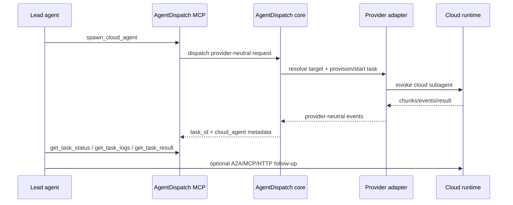

# AgentDispatch Docs

[](https://github.com/agent-dispatch/docs/actions/workflows/ci.yml)
[](https://github.com/agent-dispatch/docs/actions/workflows/local-e2e.yml)
[](https://github.com/agent-dispatch/docs/actions/workflows/live-aws-verification.yml)

Documentation for AgentDispatch: the provider-neutral MCP control plane for spawning cloud subagents.

## Start here

- [Technical design](./docs/technical-design.md) — core model, adapter boundaries, runtime protocols, and scale path.
- [AgentCore quickstart](./docs/agentcore-quickstart.md) — configure AgentDispatch and run a first cloud-agent task.
- [AWS AgentCore adapter](./docs/aws-agentcore-adapter.md) — V1 provider setup, target modes, protocols, and runtime behavior.
- [AgentCore runtime design](./docs/agent-core-runtime-design.md) — deeper AgentCore runtime notes and implementation decisions.
- [Future provider adapters](./docs/future-provider-adapters.md) — how GCP, Azure, Kubernetes, and local adapters fit the same MCP contract.
- [Package consumption](./docs/package-consumption.md) — how the separate repos and NPM packages work together.
- [Lead agent prompt kit](./docs/lead-agent-prompt-kit.md) — copy-paste prompts for Claude Code, Codex, OpenClaw, Hermes, and MCP-capable lead agents.
- [Contributor map](./docs/contributor-map.md) — where to make changes and how to choose a first contribution path.
- [Contributor issue bank](./docs/contributor-issue-bank.md) — ready-to-open adapter, worker, and architecture issues for launch-day contributor conversion.
- [Examples](./docs/examples.md) — no-cloud demo, npm canary, prompt kit, live AWS preflight, and live dispatch paths.
- [Use cases](./docs/use-cases.md) — copyable background-task prompts for repo audits, release checks, adapter design, and worker prototypes.
- [Local demo transcript](./docs/local-demo-transcript.md) — short copyable terminal path for a launch demo without live AWS credentials.
- [Verification matrix](./docs/verification-matrix.md) — what local E2E proves, what live AWS proves, and what not to claim.
- [Live AWS verification](./docs/live-aws-verification.md) — opt-in AgentCore preflight and real-dispatch proof path.
- [Release runbook](./docs/release-runbook.md) — release order, npm Trusted Publisher setup, provenance, and package publish gates.
- [Release status](./docs/release-status.md) — one local command for repo cleanliness, unpushed commits, launch gates, and live AWS evidence state.
- [Launch announcement kit](./docs/launch-announcement-kit.md) — copy for GitHub, X, LinkedIn, Hacker News, Reddit, and demo narration.
- [Repo launch checklist](./docs/repo-launch-checklist.md) — GitHub, npm, docs, demo, and social-readiness checklist for a high-signal public launch.

## Mental model

## Run The Local Demo

From the multi-repo workspace:

```bash
npm --prefix agentdispatch-docs run demo:local
```

This creates a temporary config, runs local `agentdispatch doctor`, checks the MCP server, and prints the lead-agent handoff payload without touching live AWS state.

Before a public push, release, or announcement, run the release status summary:

```bash
npm --prefix agentdispatch-docs run status:release
```

It reports repo cleanliness, commits ahead of `origin/main`, local launch gates, and whether a live AWS evidence report exists.

AgentDispatch gives lead agents one stable way to hand off long-running work:



## For lead-agent builders

OpenClaw, Hermes Agent, Claude Code, Codex, and custom orchestrators should treat AgentDispatch as the control plane:

- Configure account profiles once.
- Call `spawn_cloud_agent` when work should leave the local agent process.
- Use `task_id` to poll durable status and retrieve results.
- Use returned `cloud_agent` metadata to continue native subagent interaction when the runtime supports it.
- Start from the [lead agent prompt kit](./docs/lead-agent-prompt-kit.md) when wiring a new MCP client or recording a demo.

## For adapter builders

New providers should fit the same MCP contract:

- Declare provider, capabilities, task types, and target modes.
- Validate account profile and adapter config before starting work.
- Keep provider SDKs and provider-specific types inside the adapter package.
- Emit provider-neutral events and artifacts.
- Return protocol metadata for A2A, MCP, AG-UI, or HTTP when the runtime supports interaction.

## Package docs

- [`@agent-dispatch/core`](https://github.com/agent-dispatch/core)
- [`@agent-dispatch/mcp-server`](https://github.com/agent-dispatch/mcp-server)
- [`@agent-dispatch/sdk`](https://github.com/agent-dispatch/sdk-js)
- [`@agent-dispatch/cli`](https://github.com/agent-dispatch/cli)
- [`@agent-dispatch/store-sqlite`](https://github.com/agent-dispatch/store-sqlite)
- [`@agent-dispatch/adapter-aws-agentcore`](https://github.com/agent-dispatch/adapter-aws-agentcore)
- [`@agent-dispatch/worker-agentcore`](https://github.com/agent-dispatch/worker-agentcore)
- [`@agent-dispatch/adapter-template`](https://github.com/agent-dispatch/adapter-template)
- [`@agent-dispatch/website`](https://github.com/agent-dispatch/website)

## Status

V1 implements AWS AgentCore runtime. The docs intentionally describe the broader provider-neutral contract because AgentDispatch is designed to grow by adding adapters, not by changing the tools every lead agent depends on.
